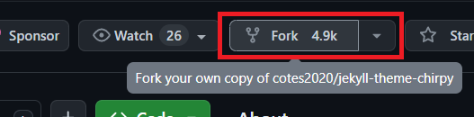

## 테마 소개
Chirpy 테마는 cotes2020 님께서 제작한 Jekyll 기반 테마입니다.

이 테마는 현재 6천이상의 stars를 받았으며, 한국어 설정이 가능하기 때문에 국내에서 이 테마를 사용하시는 분들이 많아 보입니다.

제가 Chirpy 테마를 선택한 이유는 코드의 Copy 기능과 한글화 기능, 심플한 디자인 때문이었습니다.

## 테마 설치하기
테마 설치 자체는 어렵지 않으나 설치하면서 오류가 발생하는 경우가 많았습니다.

인내심을 가지고 천천히 설치를 하면서 중간중간 에러가 발생하면 검색을 해서 코드 수정이나 설정 변경등을 진행해주시면 됩니다.

### 1. 테마 Fork 진행
먼저 [Chripy 테마 깃허브 사이트](https://github.com/cotes2020/jekyll-theme-chirpy) 에 접속하셔서 본인의 repo로 Fork 해주시길 바랍니다.

### 2. 